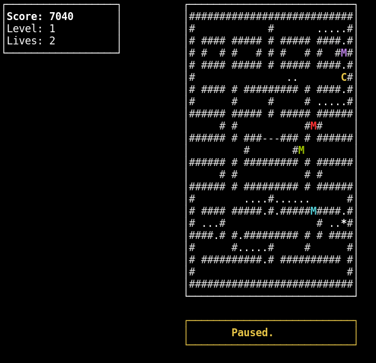

# pac-man

This is the ncurses version of the Pac-man game.  Originally the game was built
on Brick/Vty, but there were severe performance issues with that approach.

The game relies on a `Tick` event which happens every 1/60th second.  The Brick
application model merges custom events (like a timer) and keyboard events into
a single handler.  When that handler returns to Brick, Brick then evaluates
changes to the virtual display to work out whether to update the display.  And
this happens regardless of whether there *have* been any changes.

On investigating Brick's internals, it's apparent that this is very much *baked
in* to the Brick application architecture, and would be difficult to work
around without replicating much of what Brick is doing.  Therefore, I decided
to switch to ncurses where I can have much more control over when the display
is updated; the consequence is that the main UI code has to do a lot more work
in determining when to do updates, rather than just leaving it up to Brick.
This is one of the costs of optimising for efficiency over ease-of-programming.
However, this is a game, and so it is worth the cost.

For other terminal applications, I would **definitely** use Brick/Vty as it is
a much better option with scrolling windows, handling events, etc.  A really
nice library, just not the sweet spot for this game.

Best played on a terminal with no theme set, so that the original colours can
be seen.

## Screen Shot

Useful links:

* Video of ASCII pacman: https://www.youtube.com/watch?v=wZorbnsFeHQ
* Game Internals: how pac-man ghost behaviour works: http://gameinternals.com/post/2072558330/understanding-pac-man-ghost-behavior
